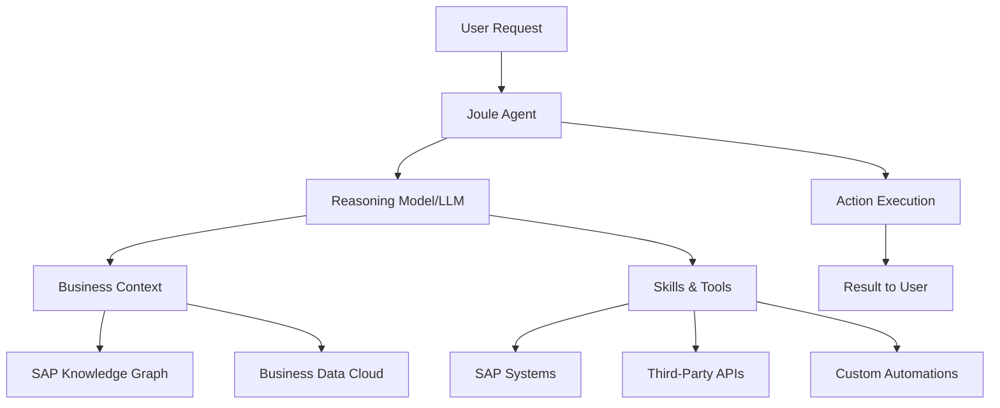
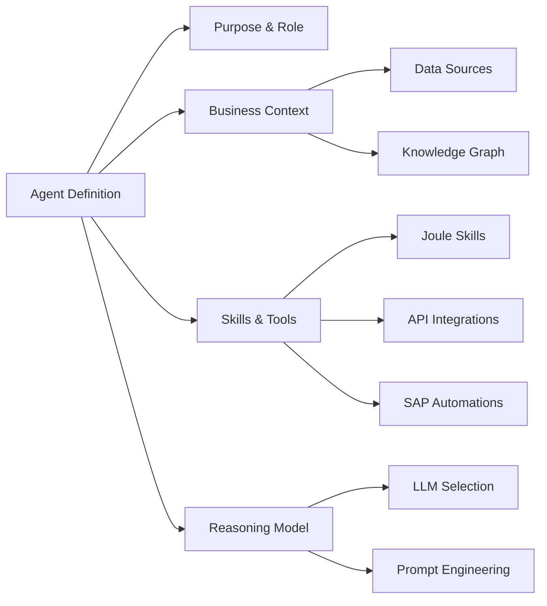
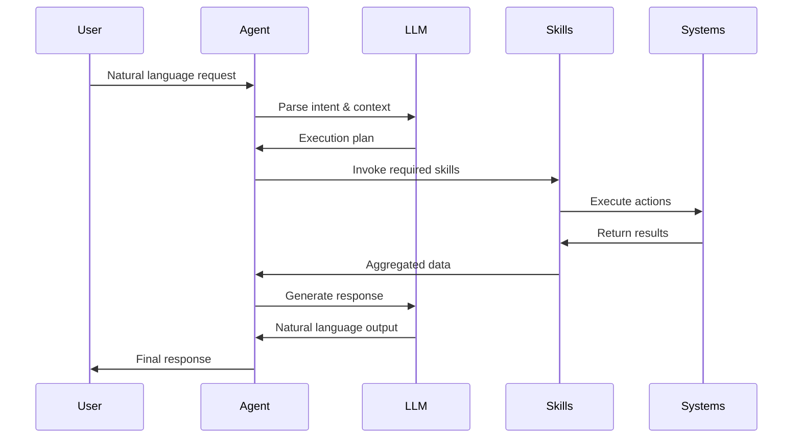
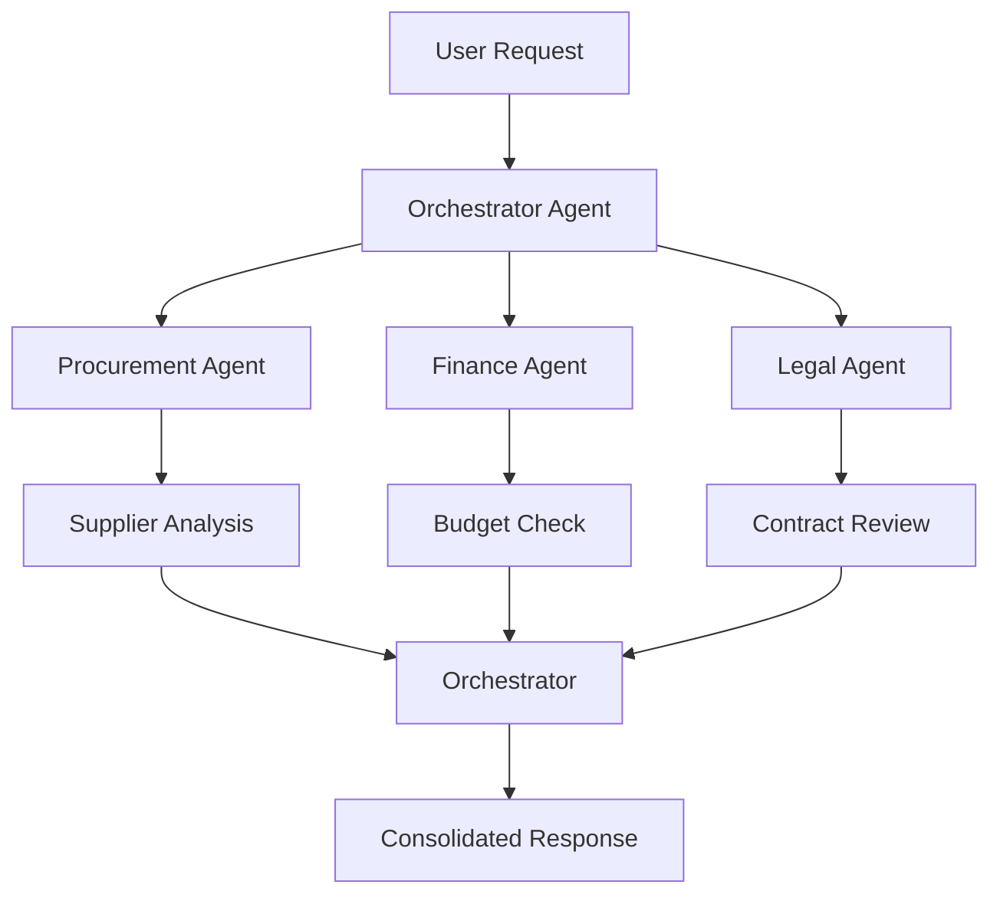

# SAP Joule AI Agent System - Complete Roadmap

## 🎯 Project Overview

This roadmap guides you through building a complete SAP Joule AI Agent system from scratch, leveraging SAP's latest agentic AI capabilities to automate business processes and enhance enterprise productivity.

---

## 📋 Table of Contents

1. [Foundation & Prerequisites](#phase-1-foundation--prerequisites)
2. [Environment Setup](#phase-2-environment-setup)
3. [Agent Design & Architecture](#phase-3-agent-design--architecture)
4. [Implementation](#phase-4-implementation)
5. [Testing & Deployment](#phase-5-testing--deployment)
6. [Documentation & Training](#phase-6-documentation--training)

---

## Phase 1: Foundation & Prerequisites

### 1.1 Understanding SAP Joule Architecture

**Key Components:**

- **Joule Studio**: Low-code/no-code platform for building custom AI agents
- **SAP Business Data Cloud**: Trusted data layer for grounding agents
- **SAP Knowledge Graph**: Decades of SAP business expertise
- **Agent Builder**: Visual interface for creating agents
- **Skill Builder**: Tool for creating reusable agent skills

**Core Concepts:**



### 1.2 System Requirements

**Technical Prerequisites:**

- SAP Business Technology Platform (BTP) account
- Joule Studio access (Q4 2025 GA)
- SAP Cloud ERP or relevant SAP solutions
- Internet connectivity for cloud services
- Modern web browser (Chrome, Edge, Safari)

**Skill Prerequisites:**

- Basic understanding of business processes
- Familiarity with SAP ecosystem (helpful but not required)
- Natural language prompt engineering
- Low-code/no-code development experience (optional)

### 1.3 Use Case Identification

**Common Agent Types:**

| Agent Type | Use Case | Business Value |
|------------|----------|----------------|
| **Procurement Agent** | Negotiate pricing, manage suppliers | Cost reduction, efficiency |
| **Finance Agent** | Automate reconciliation, reporting | Accuracy, time savings |
| **HR Agent** | Onboarding, leave management | Employee experience |
| **Sales Agent** | Lead qualification, quote generation | Revenue acceleration |
| **Supply Chain Agent** | Inventory optimization, demand planning | Reduced waste, better forecasting |
| **Customer Service Agent** | Ticket routing, knowledge retrieval | Faster resolution, satisfaction |

**Decision Matrix:**

Choose your first agent based on:
- **Impact**: High business value
- **Complexity**: Start simple, scale up
- **Data Availability**: Accessible, clean data
- **Stakeholder Buy-in**: Executive support

---

## Phase 2: Environment Setup

### 2.1 SAP BTP Account Setup

**Step-by-Step Guide:**

1. **Create SAP BTP Trial Account** (if starting fresh)
   - Visit: https://www.sap.com/products/technology-platform/trial.html
   - Sign up with business email
   - Verify email and complete registration

2. **Access BTP Cockpit**
   - Navigate to SAP BTP Cockpit
   - Create a new subaccount
   - Select appropriate region (US, EU, etc.)

3. **Configure Entitlements**
   - Enable SAP Build
   - Enable Joule services
   - Allocate service quotas

4. **Setup Cloud Foundry Environment**
   ```bash
   # Install Cloud Foundry CLI
   # Windows (PowerShell)
   winget install CloudFoundry.CLI
   
   # Login to Cloud Foundry
   cf login -a <api-endpoint> -u <username>
   ```

### 2.2 Joule Studio Access

**Access Joule Studio:**

1. Navigate to SAP Build lobby
2. Select "Joule Studio" from the menu
3. Accept terms and conditions
4. Complete initial setup wizard

**Key Configuration:**

- **Region Selection**: Choose data residency
- **User Roles**: Assign developer/admin roles
- **Security Settings**: Configure authentication
- **Governance Policies**: Set compliance rules

### 2.3 Development Environment

**Recommended Tools:**

- **SAP Business Application Studio** (cloud IDE)
- **Visual Studio Code** with SAP extensions
- **Git** for version control
- **Postman** for API testing

**VS Code Extensions:**

```json
{
  "recommendations": [
    "SAPSE.sap-ux-fiori-tools-extension-pack",
    "SAPSE.vscode-cds",
    "SAPSE.sap-ux-application-modeler-extension"
  ]
}
```

### 2.4 Authentication & Security

**Setup OAuth 2.0:**

1. Create OAuth client in BTP
2. Configure redirect URIs
3. Generate client credentials
4. Store securely in environment variables

**Security Best Practices:**

- Enable multi-factor authentication (MFA)
- Implement role-based access control (RBAC)
- Regular security audits
- Data encryption at rest and in transit

---

## Phase 3: Agent Design & Architecture

### 3.1 Agent Architecture Design

**Agent Blueprint:**



**Design Considerations:**

| Aspect | Questions to Answer |
|--------|---------------------|
| **Scope** | What specific tasks will the agent handle? |
| **Autonomy** | How much decision-making authority? |
| **Data** | What data sources are needed? |
| **Integration** | Which systems to connect? |
| **Collaboration** | Will it work with other agents? |
| **Guardrails** | What constraints and rules? |

### 3.2 Data Model Design

**Business Data Structure:**

```javascript
// Example: Procurement Agent Data Model
{
  "agent": "ProcurementNegotiator",
  "dataSources": [
    {
      "type": "SAP_S4HANA",
      "entities": ["Suppliers", "PurchaseOrders", "Contracts"],
      "accessLevel": "read-write"
    },
    {
      "type": "BUSINESS_DATA_CLOUD",
      "datasets": ["SupplierPerformance", "MarketPricing"],
      "accessLevel": "read"
    }
  ],
  "knowledgeGraph": {
    "domains": ["Procurement", "Finance", "Logistics"],
    "relationships": ["SupplierToContract", "ContractToPO"]
  }
}
```

### 3.3 Skill & Tool Planning

**Skill Types:**

1. **Deterministic Skills** (rule-based)
   - Data retrieval
   - Calculations
   - Validations

2. **AI-Powered Skills** (LLM-based)
   - Natural language understanding
   - Sentiment analysis
   - Content generation

3. **Integration Skills**
   - API calls
   - System updates
   - Notifications

**Tool Inventory:**

| Tool Category | Examples | Purpose |
|---------------|----------|---------|
| **SAP Native** | S/4HANA APIs, SuccessFactors | Core business operations |
| **Third-Party** | Salesforce, Stripe, Slack | Extended functionality |
| **Custom** | Internal APIs, databases | Proprietary systems |
| **Automation** | SAP Build Process Automation | Workflow orchestration |

### 3.4 Interaction Patterns

**Conversation Flow:**



---

## Phase 4: Implementation

### 4.1 Building Your First Agent

**Step-by-Step Implementation:**

#### Step 1: Define Agent Purpose

```markdown
Agent Name: Procurement Negotiation Assistant
Purpose: Help procurement managers develop strategies to negotiate 
         better pricing and terms with suppliers
Role: Expert procurement advisor with access to supplier data, 
      market intelligence, and historical performance metrics
```

#### Step 2: Ground with Business Context

**Connect Data Sources:**

1. Open Agent Builder in Joule Studio
2. Navigate to "Data Sources" tab
3. Add connections:
   - SAP S/4HANA (Supplier Master Data)
   - Business Data Cloud (Market Pricing)
   - Document Repository (Contracts)

**Configure Knowledge Graph:**

```json
{
  "domains": ["Procurement", "Finance"],
  "entities": [
    "Supplier",
    "Contract",
    "PurchaseOrder",
    "PriceHistory"
  ],
  "relationships": [
    {
      "from": "Supplier",
      "to": "Contract",
      "type": "has_contract"
    },
    {
      "from": "Contract",
      "to": "PriceHistory",
      "type": "contains_pricing"
    }
  ]
}
```

#### Step 3: Create Joule Skills

**Example Skill: Get Supplier Performance**

```javascript
// Skill Definition
{
  "skillName": "GetSupplierPerformance",
  "description": "Retrieves supplier performance metrics",
  "type": "deterministic",
  "inputs": [
    {
      "name": "supplierId",
      "type": "string",
      "required": true
    },
    {
      "name": "timeRange",
      "type": "string",
      "default": "12months"
    }
  ],
  "outputs": [
    {
      "name": "performanceScore",
      "type": "number"
    },
    {
      "name": "onTimeDeliveryRate",
      "type": "number"
    },
    {
      "name": "qualityScore",
      "type": "number"
    }
  ],
  "implementation": {
    "type": "API",
    "endpoint": "/api/suppliers/{supplierId}/performance",
    "method": "GET"
  }
}
```

**Create in Joule Studio:**

1. Navigate to "Skills" section
2. Click "Create New Skill"
3. Select skill type (API, Automation, Custom)
4. Configure inputs/outputs
5. Test with sample data
6. Publish skill

#### Step 4: Configure LLM & Reasoning

**Select Reasoning Model:**

- **GPT-4** for complex reasoning
- **Claude** for detailed analysis
- **Gemini** for multimodal tasks

**Add Instructions:**

```markdown
You are an expert procurement negotiation advisor. Your role is to:

1. Analyze supplier performance data
2. Research market pricing trends
3. Identify negotiation leverage points
4. Recommend negotiation strategies
5. Draft negotiation talking points

Constraints:
- Do not negotiate with suppliers who have overdue deliveries
- Always prioritize quality over price
- Ensure compliance with procurement policies
- Escalate high-value contracts (>$1M) to human approval
```

#### Step 5: Test Agent

**Test Scenarios:**

```markdown
Test 1: Basic Supplier Analysis
Prompt: "Analyze supplier ABC Corp's performance over the last year"
Expected: Performance metrics, trends, recommendations

Test 2: Negotiation Strategy
Prompt: "Help me prepare for contract renewal with XYZ Supplier"
Expected: Leverage points, market comparison, talking points

Test 3: Multi-Supplier Comparison
Prompt: "Compare pricing from our top 3 suppliers for raw materials"
Expected: Comparative analysis, cost savings opportunities
```

### 4.2 Business Data Connections

**SAP S/4HANA Integration:**

```javascript
// Connection Configuration
{
  "connectionType": "SAP_S4HANA",
  "authentication": {
    "type": "OAuth2",
    "clientId": "${env.SAP_CLIENT_ID}",
    "clientSecret": "${env.SAP_CLIENT_SECRET}",
    "tokenUrl": "https://<tenant>.s4hana.cloud.sap/oauth/token"
  },
  "endpoints": {
    "suppliers": "/API_BUSINESS_PARTNER/A_Supplier",
    "purchaseOrders": "/API_PURCHASEORDER_PROCESS_SRV/A_PurchaseOrder",
    "contracts": "/API_PURCHASING_CONTRACT_SRV/A_PurchasingContract"
  }
}
```

**Business Data Cloud Setup:**

1. Navigate to SAP Business Data Cloud
2. Create data models for your domain
3. Import historical data
4. Configure data refresh schedules
5. Set up data quality rules

### 4.3 Third-Party Integrations

**Example: Salesforce Integration**

```javascript
// MCP Server Configuration for Salesforce
{
  "name": "salesforce-connector",
  "type": "mcp-server",
  "config": {
    "instanceUrl": "https://yourinstance.salesforce.com",
    "apiVersion": "v59.0",
    "authentication": {
      "type": "OAuth2",
      "credentials": "${env.SALESFORCE_CREDENTIALS}"
    }
  },
  "capabilities": [
    "query-accounts",
    "create-opportunity",
    "update-lead"
  ]
}
```

**Microsoft 365 Copilot Integration:**

- Enable bidirectional communication (Q2-Q3 2025)
- Configure shared context
- Map data models
- Test cross-platform workflows

### 4.4 Advanced Features

**Multi-Agent Collaboration:**



**Workflow Automation:**

```javascript
// SAP Build Process Automation Integration
{
  "workflowName": "ContractApproval",
  "trigger": "agent-action",
  "steps": [
    {
      "name": "ValidateContract",
      "type": "validation",
      "rules": ["budget-check", "compliance-check"]
    },
    {
      "name": "RouteForApproval",
      "type": "approval",
      "approvers": ["procurement-manager", "finance-director"]
    },
    {
      "name": "ExecuteContract",
      "type": "action",
      "onApproval": "create-purchase-order"
    }
  ]
}
```

---

## Phase 5: Testing & Deployment

### 5.1 Testing Strategy

**Test Levels:**

| Level | Focus | Tools |
|-------|-------|-------|
| **Unit** | Individual skills | Joule Studio test panel |
| **Integration** | System connections | API testing tools |
| **Agent** | End-to-end reasoning | Conversation testing |
| **User Acceptance** | Business validation | Pilot user group |

**Test Cases Template:**

```markdown
## Test Case: TC-001
**Feature**: Supplier Performance Analysis
**Scenario**: User requests supplier performance report
**Given**: Supplier ID "SUP-12345" exists in system
**When**: User asks "Show me performance for supplier SUP-12345"
**Then**: 
  - Agent retrieves data from S/4HANA
  - Calculates performance metrics
  - Presents formatted report
  - Includes recommendations

**Pass Criteria**:
  - Response time < 5 seconds
  - All metrics accurate
  - Natural language output
  - Actionable recommendations
```

### 5.2 Execution Trace Analysis

**Monitor Agent Behavior:**

```javascript
// Execution Trace Example
{
  "requestId": "req-789",
  "timestamp": "2025-11-19T22:00:00Z",
  "userPrompt": "Help me negotiate with supplier ABC",
  "agentSteps": [
    {
      "step": 1,
      "action": "analyze-intent",
      "llmResponse": "User wants negotiation strategy for supplier ABC",
      "duration": "250ms"
    },
    {
      "step": 2,
      "action": "invoke-skill",
      "skill": "GetSupplierPerformance",
      "params": {"supplierId": "ABC"},
      "result": {"score": 85, "onTime": 92},
      "duration": "1200ms"
    },
    {
      "step": 3,
      "action": "invoke-skill",
      "skill": "GetMarketPricing",
      "result": {"avgPrice": 45.50, "trend": "decreasing"},
      "duration": "800ms"
    },
    {
      "step": 4,
      "action": "generate-response",
      "llmResponse": "Based on analysis, here's your strategy...",
      "duration": "1500ms"
    }
  ],
  "totalDuration": "3750ms",
  "status": "success"
}
```

### 5.3 Deployment Process

**Deployment Checklist:**

- [ ] All tests passed
- [ ] Security review completed
- [ ] Performance benchmarks met
- [ ] Documentation updated
- [ ] User training scheduled
- [ ] Rollback plan prepared
- [ ] Monitoring configured

**Deployment Steps:**

1. **Stage Environment**
   - Deploy to staging
   - Run smoke tests
   - Validate integrations

2. **Production Deployment**
   - Schedule maintenance window
   - Deploy agent configuration
   - Enable monitoring
   - Gradual rollout (10% → 50% → 100%)

3. **Post-Deployment**
   - Monitor error rates
   - Track user adoption
   - Collect feedback
   - Iterate improvements

### 5.4 Monitoring & Governance

**Key Metrics:**

```javascript
// Monitoring Dashboard
{
  "metrics": {
    "usage": {
      "totalRequests": 1250,
      "activeUsers": 87,
      "avgRequestsPerUser": 14.4
    },
    "performance": {
      "avgResponseTime": "3.2s",
      "successRate": "98.5%",
      "errorRate": "1.5%"
    },
    "business": {
      "tasksAutomated": 450,
      "timeSaved": "225 hours",
      "costSavings": "$15,000"
    }
  }
}
```

**Governance Framework:**

- **AI Agent Hub** (SAP LeanIX integration)
- Centralized agent inventory
- Compliance tracking
- ROI measurement
- Risk assessment

---

## Phase 6: Documentation & Training

### 6.1 User Documentation

**Documentation Structure:**

```markdown
# Agent User Guide

## Getting Started
- How to access the agent
- Basic commands
- Common use cases

## Features
- Detailed feature descriptions
- Step-by-step tutorials
- Screenshots and examples

## Best Practices
- Effective prompting
- When to use the agent
- Escalation procedures

## Troubleshooting
- Common issues
- Error messages
- Support contacts
```

### 6.2 Training Materials

**Training Program:**

1. **Introduction Session** (1 hour)
   - What is SAP Joule?
   - Agent capabilities
   - Live demonstration

2. **Hands-On Workshop** (2 hours)
   - Guided exercises
   - Real scenarios
   - Q&A session

3. **Advanced Topics** (1 hour)
   - Complex queries
   - Multi-step workflows
   - Integration with other tools

### 6.3 Best Practices Guide

**Prompt Engineering:**

```markdown
❌ Bad Prompt: "Show suppliers"
✅ Good Prompt: "Show me the top 5 suppliers by spend in the last quarter, 
                 including their performance scores"

❌ Bad Prompt: "Negotiate"
✅ Good Prompt: "Help me prepare a negotiation strategy for renewing our 
                 contract with Supplier XYZ, focusing on price reduction 
                 while maintaining quality"
```

**Agent Maintenance:**

- Regular skill updates
- LLM model upgrades
- Data source validation
- User feedback incorporation
- Performance optimization

---

## 🎯 Success Metrics

**Track These KPIs:**

| Category | Metric | Target |
|----------|--------|--------|
| **Adoption** | Active users | 80% of target audience |
| **Efficiency** | Time saved per user | 5+ hours/week |
| **Quality** | Success rate | >95% |
| **Satisfaction** | User rating | 4.5+/5.0 |
| **Business** | Cost savings | Measurable ROI |

---

## 🚀 Next Steps

1. **Immediate Actions:**
   - [ ] Set up SAP BTP trial account
   - [ ] Access Joule Studio
   - [ ] Identify first use case
   - [ ] Assemble project team

2. **Week 1-2:**
   - [ ] Complete environment setup
   - [ ] Design first agent
   - [ ] Create initial skills

3. **Week 3-4:**
   - [ ] Build and test agent
   - [ ] Pilot with small user group
   - [ ] Gather feedback

4. **Month 2+:**
   - [ ] Expand to production
   - [ ] Build additional agents
   - [ ] Optimize and scale

---

## 📚 Additional Resources

**Official SAP Resources:**
- [SAP Joule Documentation](https://help.sap.com/joule)
- [SAP Build Code](https://www.sap.com/products/technology-platform/developer-tools.html)
- [SAP Community](https://community.sap.com)

**Learning Paths:**
- SAP Learning Hub courses
- YouTube tutorials
- Hands-on workshops
- SAP TechEd sessions

**Support:**
- SAP Support Portal
- Community forums
- Partner network
- Professional services

---

## ✅ Conclusion

Building SAP Joule AI agents is a journey that combines business process knowledge with cutting-edge AI technology. This roadmap provides a structured approach to:

- Understand the technology
- Set up your environment
- Design effective agents
- Implement with best practices
- Deploy with confidence
- Scale across your organization

Start small, learn fast, and iterate continuously. The future of enterprise AI is here with SAP Joule! 🚀
