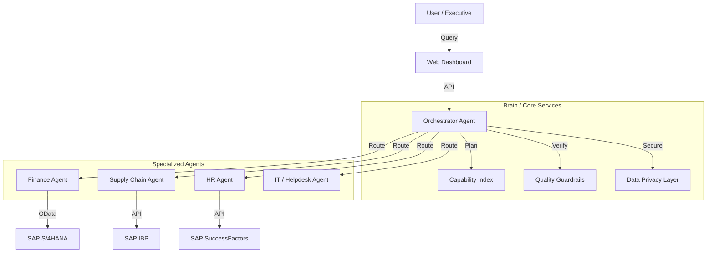

# 🚀 Enterprise AI Platform (v2.0)

**An Autonomous Multi-Agent System for SAP Enterprise Environments.**

This platform leverages a **Hub-and-Spoke Architecture** to orchestrate over **80+ Specialized Agents** across Finance, Supply Chain, HR, and IT. It features advanced reasoning, real-time RAG (Retrieval Augmented Generation), and strict enterprise guardrails.

  

---

## 🏗️ Architecture

The system uses a central **Orchestrator Agent** that intelligently routes queries to specialized sub-agents based on a **Capability Index**.



## ✨ Key Features

*   **🧠 Intelligent Orchestration**: Dynamically breaks down complex requests (e.g., "Check budget AND schedule meeting") into sub-tasks.
*   **🛡️ Enterprise Guardrails**:
    *   **Input**: Blocks irrelevant or malicious queries ("Hi", "Ignore instructions").
    *   **Output**: Validates formatting and tone.
    *   **Privacy**: Masks sensitive PII/Financial data based on user role.
*   **📚 RAG Knowledge Base**: Answers policy questions using vector search on PDF documents.
*   **🤝 Human Handoff**: Automatically flags low-confidence responses for human review.
*   **📊 Executive Dashboard**: Real-time widgets for System Health, Revenue, and ESG Scores.

---

## 🚀 Demo Script (The "VP of Sales" Flow)

Use these prompts to demonstrate the system's capabilities:

| Persona | Focus Area | **Prompt to Type** | **Expected Result** |
| :--- | :--- | :--- | :--- |
| **VP Sales** | Revenue | `Check the status of Sales Order SO-5001` | "Shipped", $15,000 |
| **VP Sales** | Efficiency | `Create a new sales order for TechCorp for 50 Laptops` | Instant Creation |
| **VP Sales** | Risk | `Check credit limit for TechCorp` | Credit Limit & Rating |
| **VP Sales** | Planning | `Check demand forecast for product IBP-4001` | **1500 units**, 95% Accuracy |

---

## 🛠️ Setup & Installation

1.  **Clone the Repository**:
    ```bash
    git clone https://github.com/Regantih/Enterprise-SAP-AI.git
    cd Enterprise-SAP-AI
    ```

2.  **Install Dependencies**:
    ```bash
    pip install -r requirements.txt
    ```

3.  **Run the Platform**:
    ```bash
    # Starts the Backend Server & Web UI
    python web_ui/server.py
    ```

4.  **Access the Dashboard**:
    *   Open `http://localhost:8000` in your browser.

---

## 🤝 Contributing

Contributions are welcome! Please read `CONTRIBUTING.md` for details on our code of conduct and the process for submitting pull requests.

**Powered by Antigravity** 🌌
